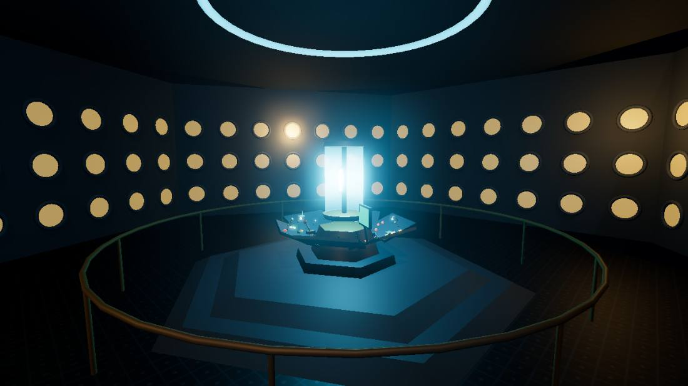

# Doctor Who: Echoes of Time

An open-world 3D Doctor Who fan game that runs in your browser. Explore four fully realised worlds with your companion Riley Vance, talk to the locals, pilot the TARDIS between eras, and face the Doctor's most iconic enemies — armed with nothing but a sonic screwdriver and excellent manners.

## Play now

**On any device (incl. phone, over WiFi or cellular):** https://skeyd87-rgb.github.io/doctor-who-echoes-of-time/

On phones the game shows touch controls automatically — a thumbstick (left) to move, drag anywhere on the right to look, and **Sonic / Jump / E** buttons plus a pause button.

## How to play (locally)

**Double-click `index.html`.** That's it. (First launch needs an internet connection — the 3D engine loads from a CDN. If the screen stays black, serve the folder instead: `python -m http.server` then open http://localhost:8000.)

Best in Chrome or Edge. If your machine struggles, the game auto-drops to Performance Mode; you can also pick Low quality on the title screen.

| Key | Action |
|---|---|
| W A S D | Move |
| Mouse | Look |
| Shift | Run |
| Space | Jump (try it on the Moon) |
| E | Talk · interact · enter the TARDIS |
| Hold Left Click | Sonic screwdriver |
| 1–4 | Dialogue choices |
| Esc | Pause |

## The adventure

A rupture in time has scattered four **Time Fragments** across history. The TARDIS console won't stop chiming about it.

- **London, October 1963** — Rain, coal smoke, and shop-window mannequins that were delivered by nobody. Mr. Harlan swears one turned its head. *(Autons)*
- **Skaro** — Twin suns over a petrified forest. A Thal scientist hiding in the rocks needs five patrol units silenced — and the black one at the city gate has not moved in six years. *(Daleks)*
- **Moonbase Artemis, 2070** — Something crashed in the great crater, and metal men are marching on the gravity regulators. Low gravity: jump accordingly. *(Cybermen)*
- **Wester Drumlins churchyard** — Ellie Shaw's brother vanished photographing the mausoleum. The statues are never where they were yesterday. **Don't blink.** *(Weeping Angels — the sonic does nothing; only your gaze holds them.)*

Recover all four fragments, then pull the lever.

Talk to everyone — quests start with conversations, NPCs wander and flee, and Riley has opinions about literally everything (press E on her). Your health is regeneration energy: it refills out of combat, and running out is... survivable, in a very Time Lord way. Progress auto-saves.

## Project layout

- `index.html` — the entire game, built as a single file
- `src/` — source split into readable parts (engine, audio synth, characters, enemies, zones, dialogue, UI, player, game core)
- `build.ps1` — concatenates `src/` into `index.html` after edits
- `docs/superpowers/specs/` — design document
- Debug URL flags: `?low` (force low quality), `?debug` (skip menu, exposes `DW.*` console helpers: `warp/cam/give/god/shot/snap`)

Everything is procedural — every character, Dalek, building and planet is generated in code; the audio (sonic whine, TARDIS materialisation, Dalek voice via speech synthesis) is synthesised live. No downloaded assets.

## Credits

A non-commercial fan tribute made for personal enjoyment. **Doctor Who is © BBC** — Daleks created by Terry Nation, Cybermen by Kit Pedler & Gerry Davis, Weeping Angels by Steven Moffat, Autons by Robert Holmes. Riley Vance is an original character.

Built with [three.js](https://threejs.org/). 🤖 Generated with [Claude Code](https://claude.com/claude-code)
